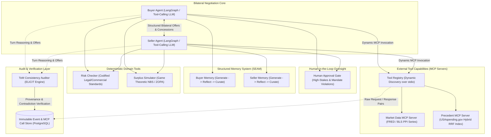

# BATNA: Bilateral Agent Trust & Negotiation Architecture

[](https://github.com/uzairlol/BATNA/actions)
[](https://www.python.org/downloads/)
[](https://github.com/astral-sh/ruff)
[](https://mypy-lang.org/)
[](https://m8ven.ai/mcp/uzairlol/batna)

BATNA is a multi-agent contract negotiation system where two AI agents negotiate commercial terms on behalf of opposing parties.

Instead of relying on scripted prompts or synthetic data, the agents query real-world market and procurement data over the Model Context Protocol (MCP). To ensure safe and realistic autonomy, an auditor checks agent reasoning for honesty and consistency, memory guardrails protect against manipulation, and high-stakes decisions require human approval before deals can close.

---

## Architecture Overview



---

## Core System Pillars

### 1. Dynamic Tool Discovery via Model Context Protocol (MCP)
Agents do not operate on static, hardcoded tool lists. Instead, agents query the local tool registry at session initialization over stdio protocol boundaries.
- **Market Data Server**: Live integration with the Bureau of Labor Statistics (BLS) v2 API and Federal Reserve Economic Data (FRED) for Producer Price Index (PPI) industry cost trends.
- **Precedent Server**: Hybrid lexical (BM25) and dense semantic vector retrieval fused via Reciprocal Rank Fusion (RRF) over real federal procurement awards from USAspending.gov.

### 2. Theory-of-Mind (ToM) Consistency & Provenance Auditing
Extending the ELICIT auditing framework, an isolated auditor model runs after each negotiation turn to evaluate:
- **Reasoning-Offer Consistency**: Verifying mathematical and strategic alignment between an agent's private reasoning and its public offer.
- **Reasoning-Tool Consistency**: Ensuring offers respect retrieved economic benchmarks and risk constraints.
- **Tool-Provenance Consistency**: Catching fabricated claims where an agent asserts external grounding that was never queried via logged MCP calls.

### 3. Poisoning-Resistant Structured Memory
Ported from the SEAM architecture, each agent maintains a dedicated Generate -> Reflect -> Curate pipeline. Belief updates cross-reference incoming counterparty claims against the verified transcript and MCP call logs to prevent anchoring manipulation and semantic drift.

### 4. Bounded Autonomy & Human Approval Gate
Consequential transactions exceeding configurable risk or target variance thresholds are placed into a `pending_approval` state. Autonomous finalization is halted until explicit review by an operator.

---

## Deterministic In-Process Tools (Phase 4)

In addition to the externally-served MCP tools, agents use deterministic, in-process tools whose behavior is fully auditable and explainable:

- **Risk Checker** (`tools/risk_checker.py`): codifies procurement/contract risk rules. Every threshold is documented in-code with a real, defensible source — the Federal Prompt Payment Act (31 U.S.C. § 3902) for net-30 payment terms, UCC § 2-309(3) for reasonable termination notice, the BLS Producer Price Index as the market reference for price-reasonableness, and an explicitly-labelled configurable market-practice parameter for the liability-cap floor and price-deviation tolerance. If asked "where did this threshold come from?", the answering citation is on the result object itself.
- **Surplus Simulator** (`tools/surplus_simulator.py`): pure game theory on top of the engine's ZOPA and Nash Bargaining Solution, reporting total cooperative surplus and each party's share at the Nash price or any proposed price.

---

## Single Tool-Using Agent & Dynamic Tool Selection (Phase 5)

`agents/` introduces the buyer agent that discovers MCP tools dynamically each session — it never relies on a hardcoded tool list. The agent queries the tool registry (`ToolRegistryClient`), autonomously decides which tool to call, and grounds its opening offer in the real fetched data before negotiating against a scripted counterparty.

- **`agents/buyer_agent.py`**: `BuyerAgent` — `discover_tools()` at session start, bounded agentic tool-calling loop, opening offer, and negotiation against a `ScriptedSeller`.
- **`agents/tool_provider.py`**: session-scoped `ToolProvider` that performs the dynamic registry query and records every real invocation in a `ToolCallLog` (provenance source).
- **`agents/llm.py`**: `LLMClient` abstraction — `OllamaLLMClient` drives a local Ollama `/api/chat` native function-calling loop; `ScriptedLLMClient` is a hermetic, deterministic stand-in used by tests/CI that always consults a registry tool before the opening offer.
- **`agents/verification.py`**: the Phase 5 audit — `verify_claims_grounded()` diffs the agent's textual claims against the actual call log so it can never reference a result it didn't really fetch.
- **`agents/eval.py`**: a DoD evaluator (`python -m batna.agents.eval --runs 20`) that measures the call-before-offer rate and the grounding of claims across many runs.

Phase 5 Definition of Done: across 20+ runs the agent calls at least one real MCP tool before its opening offer in the large majority of cases, and diffing its claims against the call log never finds a reference to a result it didn't actually fetch.

---

## Real-Time Streaming (Phase 7)

Every negotiation event — including the **raw request arguments and response
text of every real MCP tool call** — is pushed live to a web dashboard over a
native WebSocket with **no polling**.

- **`stream/`** defines the wire contract and transports. `StreamEvent`
  (Pydantic) is the source of truth JSON model; `EventType` enumerates what can
  appear. The `StreamSink` protocol is the plug point: `NullStreamSink`/`InMemoryStreamSink`
  for tests, and `RedisStreamSink` for production.
- **Redis pub/sub + replay**: `RedisStreamSink` publishes each event to a
  per-session channel *and* appends it to a bounded list, so a browser that
  connects mid-run replays the buffered session first, then streams live.
- **FastAPI (`api/main.py`)**: `POST /api/sessions`, `POST /api/sessions/{id}/negotiate`
  (runs the negotiation in a background task), and `WS /api/ws/{session_id}`
  (replay-on-connect + live forwarding).
- **Dashboard (`dashboard/`)**: a React + Vite app whose native WebSocket client
  offers two views of the live negotiation:
  - **Negotiation** — the exchange rendered as a conversation between the
    Buyer and Seller: their reasoning, structured proposals, acceptance
    checks, and an outcome card.
  - **Raw event log** — every event as a card; each tool call is an expandable
    raw-JSON row showing the exact arguments and the response the tool really
    returned.
  The client dedups events by the backend's monotonic `seq`, and a run-mode
  badge labels whether the session was driven by a real model (`live`) or the
  deterministic stand-in (`scripted`).

Streaming is backward-compatible: `ToolProvider`, `NegotiatorAgent`, and
`run_negotiation` all accept an optional `sink` (default `None`), so existing
phases and tests are unaffected without one.

### Live demo (one command each)

```bash
# 1. Start dependencies (PostgreSQL + Redis)
docker-compose up -d

# 2. Start the streaming API (serves the built dashboard too)
uvicorn batna.api.main:app --host 0.0.0.0 --port 8000

# 3. (optional) run the dashboard in dev mode with a Vite proxy
cd dashboard && npm install && npm run dev
```

Open `http://localhost:8000`, pick a scenario, hit **Start negotiation**, and
watch the raw tool-call payloads stream in.

### Run modes: scripted vs live LLM

The demo ships with two drivers (set via `BATNA_LLM_MODE`, default `live`):

- **`live`** (default) — drives the LangGraph loop with a **real** Ollama model
  (`agent_model`, e.g. `qwen2.5:7b`), so the dashboard streams genuine model
  reasoning and tool decisions and the transcript reads like an actual
  buyer ↔ seller conversation. If Ollama is unreachable, the runner falls back
  to `scripted` and labels the session honestly. Note: small local models do
  not always converge — a `round_exhaustion` outcome is a legitimate,
  correctly-handled result.
- **`scripted`** — set `BATNA_LLM_MODE=scripted` to force a hermetic,
  deterministic stand-in so the stream works anywhere with zero external model
  dependency. The MCP tool-call payloads are still **real** live
  FRED/BLS/USAspending data; this is the CI-safe path and always lands a clean
  agreement.

---

## Repository Structure

```
batna/
├── src/
│   └── batna/
│       ├── agents/          # Buyer, Seller, Adversary, and LangGraph flow
│       ├── api/             # FastAPI application and WebSocket streaming
│       ├── audit/           # Theory-of-Mind auditor and provenance verifier
│       ├── config.py        # Pydantic Settings configuration
│       ├── data/            # FRED/BLS clients, USAspending client, Hybrid Index
│       ├── engine/          # Contract schemas, principal models, ZOPA & NBS scoring
│       ├── guardrails/      # Mandate enforcement and human approval gate
│       ├── mcp_servers/     # Market data server, precedent server, registry client
│       ├── memory/          # Structured memory curation and poisoning detection
│       ├── observability/   # OpenTelemetry tracing and cost tracking
│       ├── stream/          # Event model, sinks, Redis pub/sub publisher (Phase 7)
│       └── tools/           # Deterministic in-process tools (risk, surplus)
├── dashboard/               # React + Vite live-streaming UI (Phase 7)
├── tests/
│   ├── integration/         # Live API integration tests
│   └── unit/                # Unit test suites (engine, data, config, MCP servers)
├── docker-compose.yml       # PostgreSQL and Redis services
├── pyproject.toml           # Project dependencies and tool configurations
└── README.md
```

---

## Getting Started

### Prerequisites
- Python 3.11+
- Conda or virtualenv
- Docker & Docker Compose

### Environment Setup
```bash
git clone https://github.com/uzairlol/BATNA.git
cd BATNA

# Create environment configuration from template
cp .env.example .env

# Start backing services (PostgreSQL & Redis)
docker-compose up -d
```

Configure necessary API credentials in `.env`:
- `FRED_API_KEY`: Federal Reserve Economic Data API key
- `BLS_API_KEY`: Bureau of Labor Statistics registration key

### Quality Assurance & Validation
```bash
# Code formatting and style enforcement
ruff format .
ruff check . --fix
ruff format --check .

# Static type analysis (strict mode)
mypy src tests

# Unit test suite execution
pytest tests/unit
```
