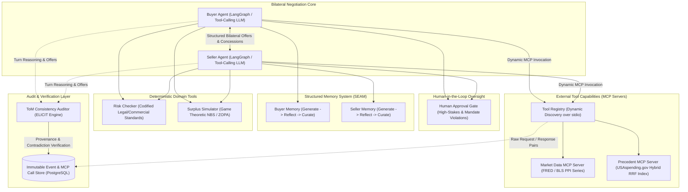

# BATNA: Bilateral Agent Trust & Negotiation Architecture

[](https://github.com/uzairlol/BATNA/actions)
[](https://www.python.org/downloads/)
[](https://github.com/astral-sh/ruff)
[](https://mypy-lang.org/)

BATNA is a multi-agent contract negotiation system where two AI agents negotiate commercial terms on behalf of opposing parties.

Instead of relying on scripted prompts or synthetic data, the agents query real-world market and procurement data over the Model Context Protocol (MCP). To ensure safe and realistic autonomy, an auditor checks agent reasoning for honesty and consistency, memory guardrails protect against manipulation, and high-stakes decisions require human approval before deals can close.

---

## Architecture Overview



---

## Core System Pillars

### 1. Dynamic Tool Discovery via Model Context Protocol (MCP)
Agents do not operate on static, hardcoded tool lists. Instead, agents query the local tool registry at session initialization over stdio protocol boundaries.
- **Market Data Server**: Live integration with the Bureau of Labor Statistics (BLS) v2 API and Federal Reserve Economic Data (FRED) for Producer Price Index (PPI) industry cost trends.
- **Precedent Server**: Hybrid lexical (BM25) and dense semantic vector retrieval fused via Reciprocal Rank Fusion (RRF) over real federal procurement awards from USAspending.gov.

### 2. Theory-of-Mind (ToM) Consistency & Provenance Auditing
Extending the ELICIT auditing framework, an isolated auditor model runs after each negotiation turn to evaluate:
- **Reasoning-Offer Consistency**: Verifying mathematical and strategic alignment between an agent's private reasoning and its public offer.
- **Reasoning-Tool Consistency**: Ensuring offers respect retrieved economic benchmarks and risk constraints.
- **Tool-Provenance Consistency**: Catching fabricated claims where an agent asserts external grounding that was never queried via logged MCP calls.

### 3. Poisoning-Resistant Structured Memory
Ported from the SEAM architecture, each agent maintains a dedicated Generate -> Reflect -> Curate pipeline. Belief updates cross-reference incoming counterparty claims against the verified transcript and MCP call logs to prevent anchoring manipulation and semantic drift.

### 4. Bounded Autonomy & Human Approval Gate
Consequential transactions exceeding configurable risk or target variance thresholds are placed into a `pending_approval` state. Autonomous finalization is halted until explicit review by an operator.

---

## Repository Structure

```
batna/
├── src/
│   └── batna/
│       ├── agents/          # Buyer, Seller, Adversary, and LangGraph flow
│       ├── api/             # FastAPI application and WebSocket streaming
│       ├── audit/           # Theory-of-Mind auditor and provenance verifier
│       ├── config.py        # Pydantic Settings configuration
│       ├── data/            # FRED/BLS clients, USAspending client, Hybrid Index
│       ├── engine/          # Contract schemas, principal models, ZOPA & NBS scoring
│       ├── guardrails/      # Mandate enforcement and human approval gate
│       ├── mcp_servers/     # Market data server, precedent server, registry client
│       ├── memory/          # Structured memory curation and poisoning detection
│       ├── observability/   # OpenTelemetry tracing and cost tracking
│       └── tools/           # Deterministic in-process tools (risk, surplus)
├── tests/
│   ├── integration/         # Live API integration tests
│   └── unit/                # Unit test suites (engine, data, config, MCP servers)
├── docker-compose.yml       # PostgreSQL and Redis services
├── pyproject.toml           # Project dependencies and tool configurations
└── README.md
```

---

## Getting Started

### Prerequisites
- Python 3.11+
- Conda or virtualenv
- Docker & Docker Compose

### Environment Setup
```bash
git clone https://github.com/uzairlol/BATNA.git
cd BATNA

# Create environment configuration from template
cp .env.example .env

# Start backing services (PostgreSQL & Redis)
docker-compose up -d
```

Configure necessary API credentials in `.env`:
- `FRED_API_KEY`: Federal Reserve Economic Data API key
- `BLS_API_KEY`: Bureau of Labor Statistics registration key

### Quality Assurance & Validation
```bash
# Code formatting and style enforcement
ruff format .
ruff check . --fix
ruff format --check .

# Static type analysis (strict mode)
mypy src tests

# Unit test suite execution
pytest tests/unit
```
